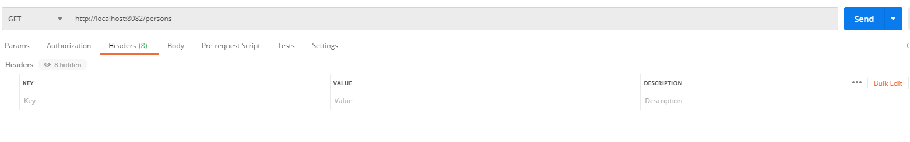
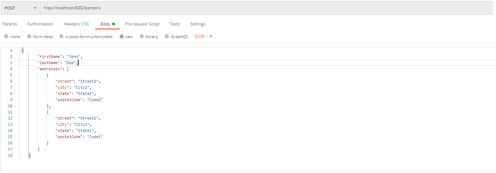
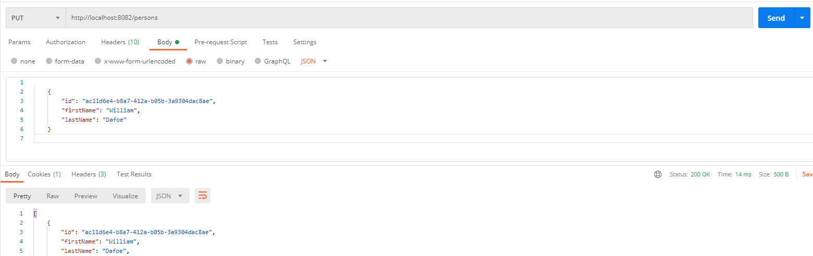

# Accela Project Backend

## Test
* Run all unit tests: `mvn test`

## Build
* Run maven build: `mvn clean install`
* Generated artifacts in ./target

## Run
* Run spring boot application using maven: `./mvnw spring-boot:run`

## Endpoints
* Best tested using Postman utility
  * Call http://localhost:8082/persons with verb:
    * GET     to list all persons 
    * POST  , with a JSON body like the example, to add a new person 
    * Put  , with a JSON body like the example (make sure id field exists, for example by calling GET), to edit an existing person 
  * Call http://localhost:8082/persons/{id} with verb:
    * DELETE     to delete a person having id

# Database
* To access the database console (while application is running):
  * `http://localhost:8082/h2-console`
  * `Generic H2 (Server)` from Saved Settings menu
  * `jdbc:h2:mem:myDb` for JDBC URL
  * `accela` for User Name and Password

